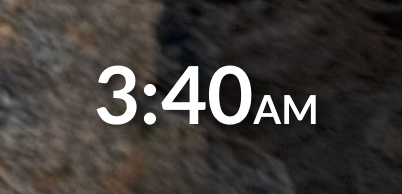
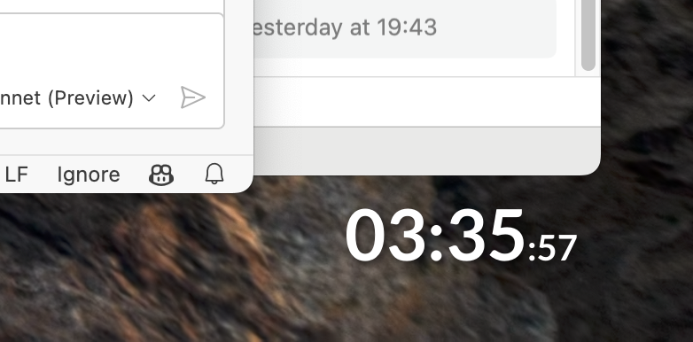
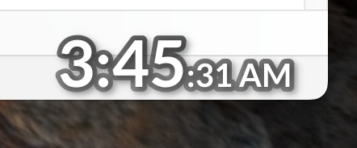

# jClock - Floating Desktop Clock

A minimalist, customizable floating clock for macOS built with Python and PySide6.

## Screenshots

### Clock Styles

*12h clock with drop shadow, am pm 0.5 size*


*24h clock with drop shadow, seconds 0.5 size*


*12h clock with 2 transparent and gradient outlining, drop shadow, seconds & am pm 0.5 size*

### Controls

*Easy access to settings via system tray*

## Features
- Transparent, floating clock that stays on top
- Auto-hide when mouse is nearby
- Fullscreen app detection
- Customizable appearance (font, colors, shadows)
- System tray controls
- Configurable through settings.ini

## Requirements
- Python 3.8+
- macOS (tested on 10.15+)

## Installation
1. Clone the repository:
```bash
git clone https://github.com/smvueno/jClock.git
cd jClock
```

2. Create and activate virtual environment:
```bash
python3 -m venv venv
source venv/bin/activate
```

3. Install dependencies:
```bash
pip install -r requirements.txt
```

4. Run cleanup script to optimize PySide6 installation:
```bash
python cleanup_pyside.py
```

## Usage
Run the clock:
```bash
python main.py
```

## Configuration
Edit `config/settings.ini` to customize the clock's appearance and behavior.

## License
This project is licensed under the MIT License - see the [LICENSE](LICENSE) file for details.
